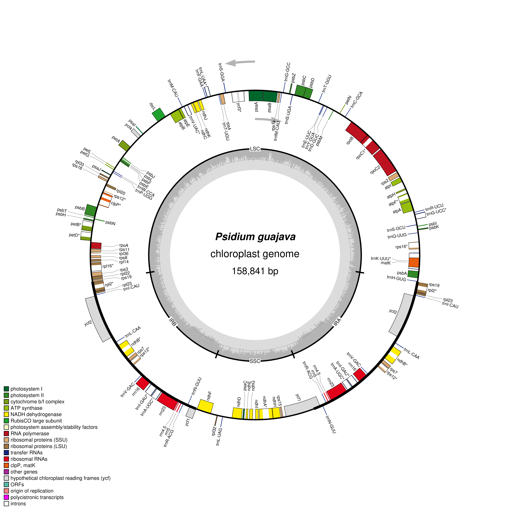

# Visualize Plastid Genome Structure

**Cell and Molecular Biology — Laboratory Activity**

**Student:** Shekhan Fredianne C. Trayvilla  
**Scientific name:** *Psidium guajava* L.  
**Family:** Myrtaceae  
**NCBI accession:** NC_033355.1  
**Plastid genome length:** 158,841 bp  
**Visualization software:** OGDRAW (OrganellarGenomeDRAW)

## Genome Data Source

The annotated chloroplast genome of *Psidium guajava* was obtained from the National Center for Biotechnology Information (NCBI), accession NC_033355.1. The original GenBank file is stored in the `data/` folder.

## Visualization Method

The annotated GenBank file was uploaded to OGDRAW using Standard mode. A circular plastid genome map was generated with automatic inverted-repeat detection, a GC content graph, transcription-direction indicators, and intron-containing gene labels. PNG was selected as the output format.

## Circular Plastid Genome Map

## Genome Structure and Interpretation

The chloroplast genome of *Psidium guajava* is 158,841 bp long and has a quadripartite structure consisting of a large single-copy (LSC) region, a small single-copy (SSC) region, and two inverted-repeat regions (IRa and IRb).

The genome map shows genes arranged around the circular genome, with different colors representing functional gene categories. The arrows indicate transcription direction, while the inner GC content graph illustrates variation in nucleotide composition.

## Laboratory Answers

The answers to the ten laboratory questions are documented in:

[Lab_plastid_genome_answers.md](answers/Lab_plastid_genome_answers.md)

## References

- NCBI: https://www.ncbi.nlm.nih.gov/nuccore/NC_033355.1
- OGDRAW: https://chlorobox.mpimp-golm.mpg.de/OGDraw.html
- Greiner, S., Lehwark, P., & Bock, R. (2019). OrganellarGenomeDRAW (OGDRAW) version 1.3.1: Expanded toolkit for the graphical visualization of organellar genomes. *Nucleic Acids Research*, 47, W59–W64.
